# Challenge 17 - Credit Risk Analysis
## Overview of the Analysis
The following report employs different techniques to train and evaluate models with unbalanced classes to determine credit risk.

Libraries Used:
* scikit-learn
* imbalanced-learn

## Deliverable 1 - Use Resampling Models to Predict Credit Risk
For this Deliverable 1, three (3) machine learning models were used to resample the data to improve the model for predicting credit risk. Prior to determining the Basline Model, the preprocessing steps were taken to clean the data. Null values were removed, interest rates were turned into float datatypes, and various data values were labeled. Unnecessary data that only had one value were removed. New columns were created to convert object datatypes into binary columns. Finally the data was scaled to using StandardScaler() to maintain a mean of 0 and a deviation of 1.

* Original Data is extrmely "unbalanced", with only 0.50% of the data represents "high-risk" loans.
 low_risk     68470
 high_risk      347

* After traiing, testing and spliting the model, our "y_train" shows 0.48% of the data represents "high-risk" loans.
 low_risk     51366
 high_risk      246

### Baseline Model
Using LogisticsRegressions, the baseline model shows an accuracy score of 99.5% for identifying "low-risk" loans.

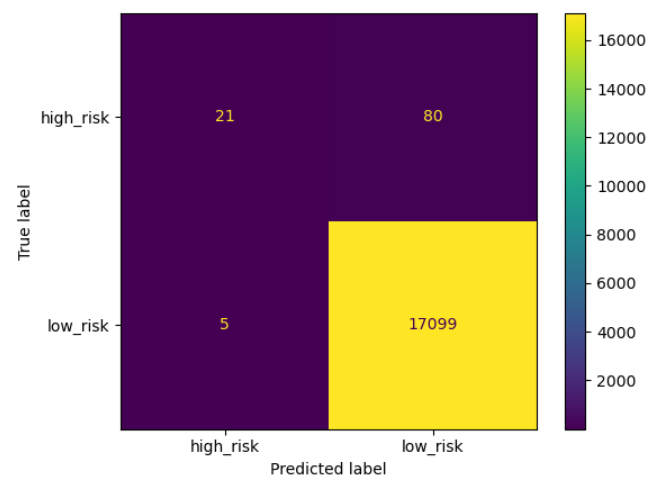

The Baseline Classification Report shows a very low F1 Score of 33% for identifying high-risk loans, verses 100% for low-risk loans.

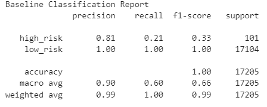

### Baseline Imbalanced Classification Report
Based on the Baseline Model, there is a need to try Oversampling in order to create a more balanced and improved model.

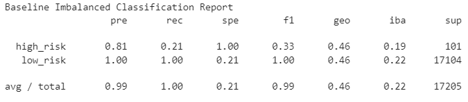

### RandomOverSampler Technique
THe Balance Accuracy Socre was 83.25%. 

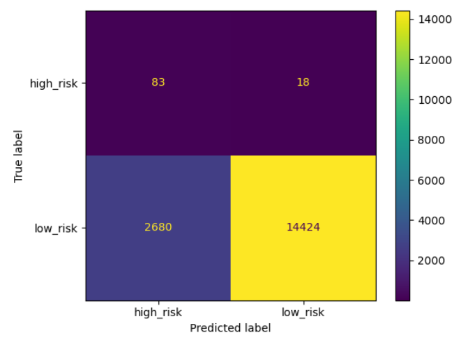

This technique deteriorated the model, reducing the F1 score for both high-risk and low-risk accuracy.

### SMOTE Oversampling Technique
Using IMBLearn's synthetic minority oversampling technique (SMOTE) approach, this technique produced a model with a Balanced Accuracy Score of 84.41%. 

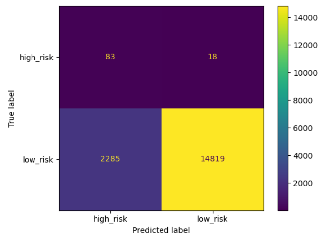

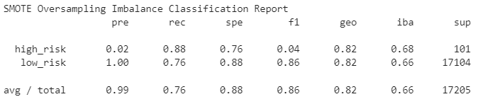

### Cluster Centroids Undersampling Technique
Similar to the SMOTE approach, Cluster Centroid undersampling technique produced a model that was 82.04% accurate. 

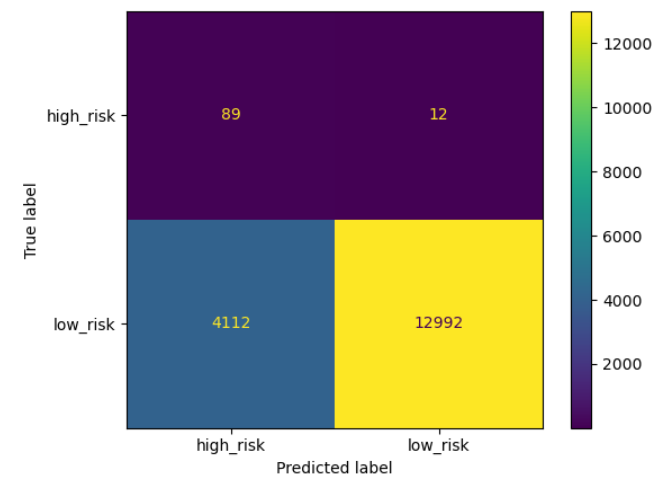

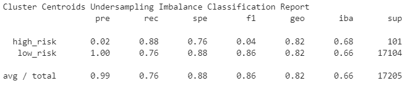

## Deliverable 2 - Use the SMOTEENN algorithm to Predict Credit Risk
Oversampling and Undersampling did not seem to produce a viable model to accurately predict high-risk. A combinatorial approach such as SMOTE and Edited Nearest Neighbors (ENN) aka SMOTEENN was used. 

The approached produced a Balanced Accuracy Score of 84.40%.

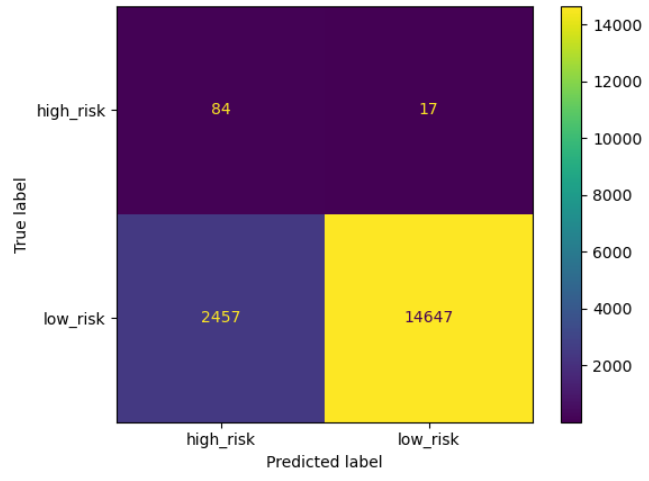

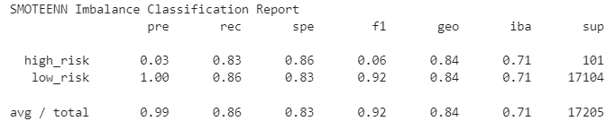

## Deliverable 3 - Use Ensemble Classifiers to Predict Credit Risk

### Balanced Random Forest Classifier
The Balanced Accuracy Socre for the Random Forest approach was 75.89%

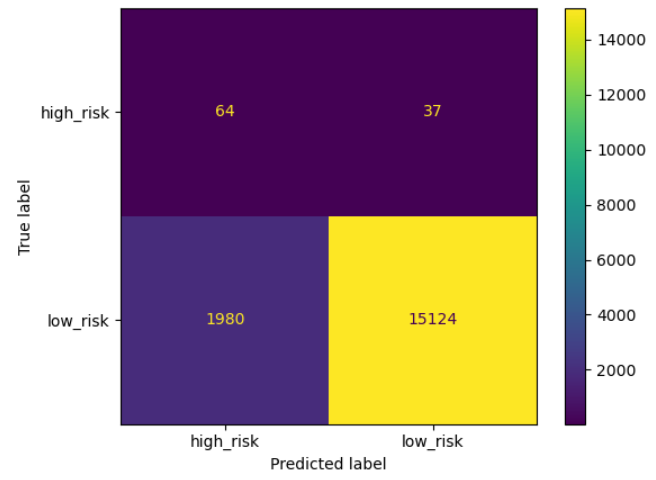

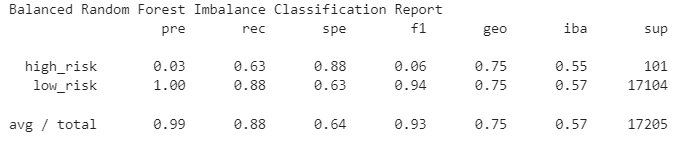

### Balanced Random Forest Classifier
The Balanced Accuracy Socre for the Random Forest approach was 75.89%

The top 5 features of importance and bottom 5 features of least importance are as follows. The features of lease important should be removed from the model.

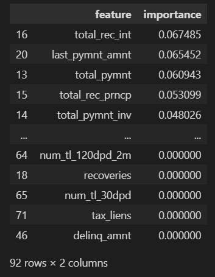

### Easy Ensemble AdaBoost Classifier
The Balanced Accuracy Socre for the Easy Ensemble AdaBoost approach was 93.19%

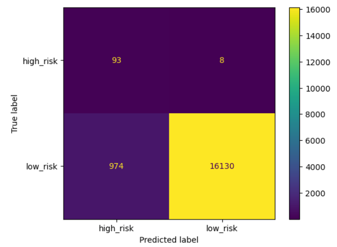

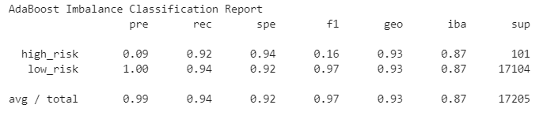

## Summary
None of the techniques performed above helped to improved the accuracy for identifying high-risk loans. The highest F1 Score came from the Easy Ensemble AdaBoost Classifer with a score of 0.16 Unforunately, this is still not adequate. All the other resampling models did poorly with 0.06 or less.